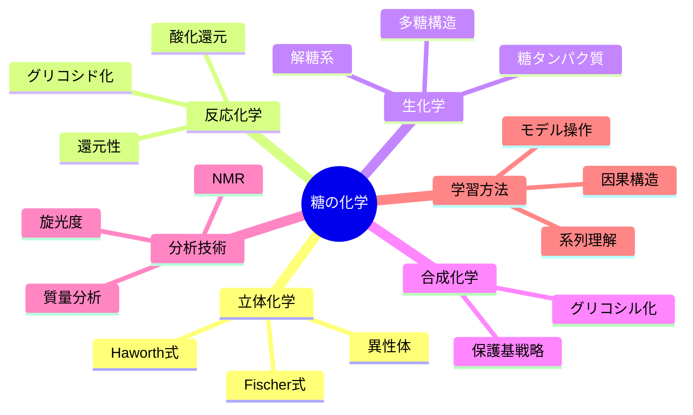

Markdownで記事を書けます。

糖の化学を学ぶときの「中心問題」と「その他の諸問題」も、Vue3と同様に構造的に整理できます。糖化学（Carbohydrate Chemistry）は単なる「糖の名前暗記」ではなく、**構造・反応・生体機能・合成**の関係網を理解することが本質です。以下のように体系化できます。

---

## 🍬 I. 中心問題：**立体化学と結合の多様性**

### 1. **中心テーマ：異性体の森をどう整理するか**

* 同じ分子式 C₆H₁₂O₆ でも異性体が膨大。
* 糖の化学では「どこが違うのか」を見抜く能力が最重要。

| 区分         | 主な異性            | 特徴          |
| ---------- | --------------- | ----------- |
| **構造異性体**  | アルドース vs ケトース   | カルボニル基の位置   |
| **立体異性体**  | D/L, エピマー, アノマー | 不斉炭素の向き     |
| **環構造異性体** | α/β-ピラノース・フラノース | ヘミアセタール形成位置 |
| **配座異性体**  | 椅子型・舟型          | エネルギー安定性の差  |

→ **中心問題：立体化学を空間的に把握し、表記体系を自在に変換できるか**

---

## 🧭 II. 構造的諸問題（概念・表記・構造変換）

| 問題領域    | 中心課題                    | 解法・観点                |
| ------- | ----------------------- | -------------------- |
| **表記法** | Fischer → Haworth → 構造式 | 空間の対応づけ              |
| **命名法** | グリコシド結合の命名              | α/βと結合位置（1→4, 1→6など） |
| **異性化** | エピマー化・変旋光               | 平衡と触媒作用              |
| **重合**  | モノ → ジ → ポリ糖            | 結合パターンと機能の変化         |

---

## ⚗️ III. 反応化学的諸問題（化学変化・分析）

1. **還元性・酸化性**

   * フェーリング反応・トロロンス試薬による検出
   * 還元末端を持つ糖と持たない糖の区別

2. **異性化反応**

   * アルドース ↔ ケトースのロベリ変換（enediol中間体）
   * エピマー化（アルドース同士の平衡）

3. **グリコシド化反応**

   * アノマー炭素とアルコールの縮合によるグリコシド形成
   * 酵素的（生体内） vs 化学的（合成化学）

4. **酸化・還元反応**

   * 酸化：グルコン酸・グルクロン酸
   * 還元：ソルビトール生成

5. **分析法**

   * 光学活性（旋光度測定）
   * NMR・MSによる構造決定
   * メチル化分析による結合様式特定

---

## 🌿 IV. 生体化学的諸問題（機能・代謝）

| 領域         | 中心課題                 | 例                        |
| ---------- | -------------------- | ------------------------ |
| **代謝**     | 解糖系・グリコーゲン合成・分解      | グルコース-6-リン酸を中心に展開        |
| **構造多糖**   | セルロース vs デンプン vs キチン | β-1,4 と α-1,4 の違いが機能を決める |
| **糖タンパク質** | グリコシル化の生理的意味         | シグナル・免疫・認識               |
| **糖脂質**    | 膜認識・血液型抗原            | ガラクトース・N-アセチル化糖の配列       |

---

## 🧬 V. 合成化学的諸問題（人工糖鎖合成）

* **選択的グリコシル化**：どのOH基を活性化するか
* **立体選択性制御**：α/β選択的結合形成
* **保護基戦略**：選択的反応性のデザイン
* **自動合成・固相合成**：近年の糖鎖工学の中心技術

---

## 🧠 VI. メタ問題：糖化学をどう学ぶか

* **構造を描いて覚える学問**：3Dモデル・投影図・VR構造ビューアの活用
* **系列理解**：「単糖 → 二糖 → 多糖 → 糖タンパク質」と階層的に整理
* **反応経路の因果構造**を意識：
  → 「立体配置が反応性を決める」「保護基が選択性を決める」

---

## 🗺 VII. 全体マップ（糖化学の学習地図）

---

ご希望があれば、
これを「**糖化学学習設計図（BaseFrame版）**」として：

* 週次テーマ構成（例：第1週 立体化学、第2週 グリコシド化…）
* 各回の理解到達目標（概念／反応／応用）
* 対応する参考書・3Dビューワ・実験教材リンク

のかたちでテンプレート化できます。
作成しましょうか？
